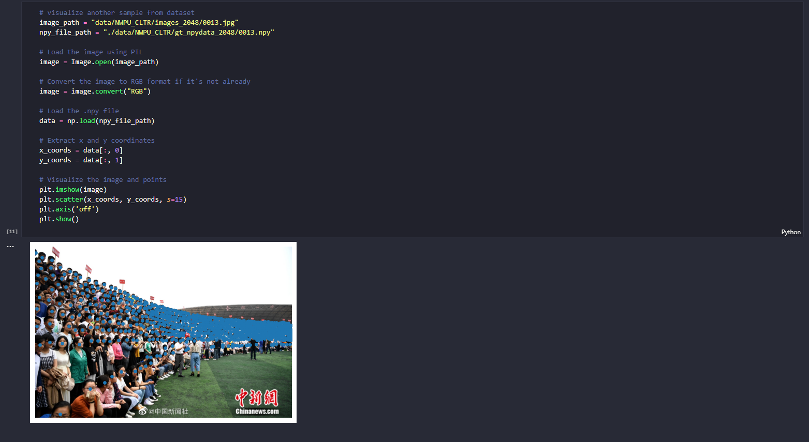

### An End-to-End Transformer Model for Crowd Localization

The purpose of the final project in CMP719 is to implement the research paper titled [An End-to-End Transformer Model for Crowd Localization](https://arxiv.org/pdf/2202.13065.pdf). The paper serves as the reference for my work. Through a thorough understanding of the paper, the aim is to develop a deep comprehension of the proposed transformer model and its applications in crowd localization. By independently coding and implementing the model, the objective is to demonstrate proficiency in reproducing the results and insights outlined in the paper.

> ⚠️ **Warning**: The following images are snapshots from my notebook. Although the notebook is shared on GitHub, it cannot be directly rendered there due to its large file size. To view the notebook as shown in the images, please download this repository. Make sure to place the "images" folder in the same directory as the Jupyter notebook.

 

  

  

  

  

  

  

  

  

  

  

  

